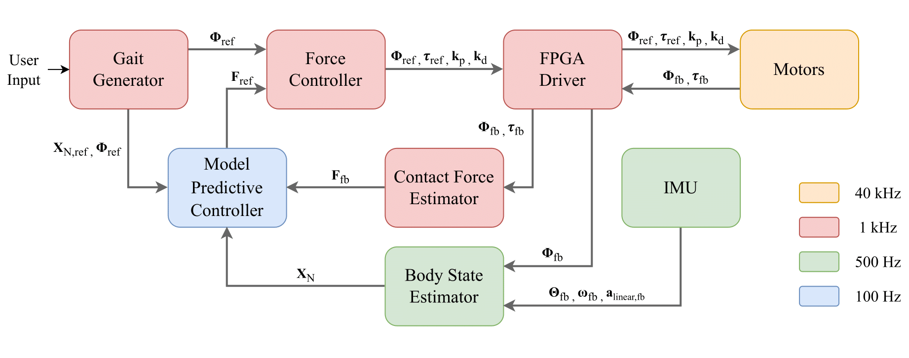

# corgi_mpc

ROS 2 controllers for the Corgi leg-wheel robot. The closed-loop walking controllers use model predictive control (MPC) to compute contact-force references and publish impedance commands. The package also contains open-loop H20/V10, trot, and WLW gait controllers that publish motor commands directly.

## Research basis and architecture

The closed-loop MPC algorithm is based on Yi-Syuan Shen's 2025 master's thesis, [輪腳複合機器人上可變多觸地點之全機力控制架構開發](https://tdr.lib.ntu.edu.tw/jspui/handle/123456789/99482?mode=full) (National Taiwan University, DOI: [10.6342/NTU202502013](https://doi.org/10.6342/NTU202502013)). The thesis describes a whole-body force-control architecture for a leg-wheel robot with varying ground contact points. This package implements the MPC controller and the launch integrations documented below; the open-loop gait executables serve different control paths.



*System-level MPC architecture. Gait references and estimated body/contact states feed the MPC. Its force references pass through force control and the motor driver. The frequencies in the supplied diagram describe that architecture; this README does not assert that every current ROS node runs at the frequency shown.*

## Quick start

Run these commands from a sourced ROS 2 workspace containing the required packages. Start the simulator separately for simulation modes. Start the motor driver separately before running a real-robot mode. The controller currently loads `config/config.yaml` from `~/corgi_ws/corgi_ros2_ws/src/corgi_mpc/config/config.yaml`; check this path if the workspace is elsewhere.

```bash
# Simulation: closed-loop walking with legacy odometry; stop after a set time.
ros2 launch corgi_mpc walk_closed.launch.py environment:=sim stop_mode:=time state_source:=odom_legacy

# Real robot: closed-loop walking with legacy odometry; stop near stop_x.
ros2 launch corgi_mpc walk_closed.launch.py environment:=real stop_mode:=distance state_source:=odom_legacy

# Real robot: ESEKF state, GMO contact, and distance-based stopping.
ros2 launch corgi_mpc walk_closed.launch.py environment:=real stop_mode:=distance state_source:=esekf contact_source:=gmo

# Real robot: open-loop H20/V10 walking.
ros2 launch corgi_mpc walk_open.launch.py environment:=real gait:=h20_v10

# Simulation: open-loop WLW gait.
ros2 launch corgi_mpc walk_open.launch.py environment:=sim gait:=wlw
```

Real-robot closed-loop and H20/V10 launches record a bag by default. WLW and simulation do not; add `record_bag:=true` to enable recording. ESEKF starts its bag after 15 seconds, while other modes start after 3 seconds.

## Controllers and operating modes

| Executable | Control path | Output | Stop or duration rule |
|---|---|---|---|
| `walk_closed_time` | Closed-loop MPC | `/impedance/command` | `common.walk.target_loop` control cycles |
| `walk_closed_dist` | Closed-loop MPC | `/impedance/command` | Decelerate near `common.walk.stop_x` |
| `walk_h20_v10_open` | Open-loop H20/V10 gait | `/motor/command` | Controller's internal `target_loop` |
| `wlw_open` | Open-loop WLW Hybrid gait | `/motor/command` | `common.wlw.target_loop` duration setting |
| `trot_open` | Open-loop trot gait | `/motor/command` | `common.trot.target_loop` duration setting |

All five executables publish `/walk/swing_phase`. `trot_open` is built and installed but has no entry in the consolidated launch files; run it only with the supporting system required by that controller. The open-loop controllers do not use the `state_source` argument and do not launch force control.

### Closed-loop launch arguments

| Argument | Default | Purpose |
|---|---|---|
| `environment` | `sim` | `sim` or `real`; selects supporting nodes and automatic defaults |
| `stop_mode` | `time` | `time` selects `walk_closed_time`; `distance` selects `walk_closed_dist` |
| `state_source` | `odom_legacy` | `odom_legacy`, `sim_driver`, or `esekf` |
| `contact_source` | `gait` | `gait` or `gmo`; GMO requires ESEKF |
| `use_sim_time` | `auto` | `auto` follows `environment`, or set `true`/`false` |
| `config_profile` | `auto` | `auto` follows `environment`, or set `sim`/`real` |
| `record_bag` | `auto` | `auto` records on the real robot only, or set `true`/`false` |
| `record_raw_lidar` | `false` | Include raw Livox topics in an ESEKF bag |

The selected state source determines which support nodes start:

| State source | Supported environment | State inputs | Launched support nodes |
|---|---|---|---|
| `odom_legacy` | Simulation or real robot | Legacy position/velocity and `/imu` | Legacy odometry and height estimator; real robot also starts `imu_node` |
| `sim_driver` | Simulation only | `/tf` (`odom` to `base_link`) and `/sim/body/velocity` | Legacy odometry and height estimator for controller fallback; the simulator supplies primary state and IMU |
| `esekf` | Real robot only | `/ekf`, with `/imu_raw` available before EKF data | `esekf_stack.launch.py`: raw IMU, leg ESEKF, Livox, FAST-LIO, odometry relay, fusion, and static TF |

Every closed-loop mode also launches force estimation and force control. The controller publishes `/impedance/command`; force control converts it to `/motor/command`. `contact_source:=gmo` selects measured contact when GMO data is available. The controller's default is `gait`: the `real.contact_source` value in `config.yaml` does not set this ROS parameter.

### Open-loop launch arguments

`walk_open.launch.py` accepts `environment:=sim/real`, `gait:=h20_v10/wlw`, `use_sim_time:=auto/true/false`, `config_profile:=auto/sim/real`, and `record_bag:=auto/true/false`. Real H20/V10 also launches IMU, force estimation, and legacy odometry nodes for experiment data. WLW launches only its controller node. Both publish `/motor/command` directly.

## ROS interfaces

| Controller | Subscribed topics | Published topics |
|---|---|---|
| Closed-loop, common | `/trigger`, `/motor/state` | `/impedance/command`, `/walk/swing_phase` |
| Closed-loop, legacy state | `/imu`, `/odometry/legacy/position`, `/odometry/legacy/velocity`, `/odometry/legacy/z_position_hip` | Same closed-loop outputs |
| Closed-loop, simulator state | `/tf`, `/sim/body/velocity`, `/imu`; legacy topics support fallback | Same closed-loop outputs |
| Closed-loop, ESEKF state | `/ekf`, `/imu_raw`; `/gmo/contact_state` when GMO contact is selected | Same closed-loop outputs |
| Open-loop H20/V10, trot, or WLW | `/trigger` | `/motor/command`, `/walk/swing_phase` |

The closed-loop executables subscribe to all supported state topics; `state_source` selects which incoming data drives the controller. Topic names above are shown from the default root namespace.

## Configuration

Settings are in [config/config.yaml](config/config.yaml):

- `common.walk` holds the closed-loop walking height, speed, step geometry, acceleration ramp, `target_loop`, `stop_x`, and `decel_margin`.
- `common.trot` and `common.wlw` hold the respective open-loop gait settings.
- `sim` and `real` hold profile-specific MPC weights, impedance gains, force bounds, and initial joint angles. The selected profile takes precedence over shared gait settings where the controller implements that lookup.

For `walk_closed_time`, the default `target_loop` is 2200 cycles. With the controller's 100 Hz time step, this is 22 seconds after walking starts. For `walk_closed_dist`, the default `stop_x` is 3.0 m and `decel_margin` is 1.2. These are configuration values, not launch arguments. The H20/V10 open-loop controller still contains some gait values in its source, so the YAML file is not its complete configuration.

## Bag recording

`script/record_mpc_bag.py` selects the topic set from the controller mode. Every set includes `/trigger`, `/motor/state`, `/motor/command`, and `/walk/swing_phase`.

| Mode | Additional recorded topics |
|---|---|
| Closed, `odom_legacy` | `/force/state`, `/impedance/command`, `/imu`, and `/odometry/legacy/{position,velocity,contact,z_position_hip}` |
| Closed, `sim_driver` | Closed legacy set plus `/tf` and `/sim/body/velocity` |
| Closed, `esekf` | `/force/state`, `/impedance/command`, `/imu_raw`, `/ekf`, `/gmo/contact_state`, `/lidar_odom`, `/odom_mapping`, `/fusion/bv` |
| Open, `h20_v10` | `/force/state`, `/imu`, and legacy odometry topics |
| Open, `wlw` | No additional topics |

Set `record_raw_lidar:=true` with ESEKF to add `/livox/lidar`, `/livox/imu`, and `/Odometry`. ESEKF recording starts 15 seconds after launch, so that initial period is not in the bag. The default output is `bag/mpc_<state_source_or_gait>_<timestamp>` in the source package when it is available. The older shell recorders remain available for manual use.

To inspect a topic list without recording:

```bash
python3 src/corgi_mpc/script/record_mpc_bag.py --controller closed --state-source esekf --print-topics
```

## Legacy launch names

The previous launch names remain as compatibility entry points:

| Existing file | New selection |
|---|---|
| `walk_closed_sim.launch.py` | `walk_closed.launch.py environment:=sim stop_mode:=time state_source:=odom_legacy` |
| `walk_closed_real.launch.py` | `walk_closed.launch.py environment:=real stop_mode:=time state_source:=odom_legacy` |
| `walk_closed_legacy.launch.py` | `walk_closed.launch.py environment:=real stop_mode:=distance state_source:=odom_legacy` |
| `walk_closed_esekf.launch.py` | `walk_closed.launch.py environment:=real stop_mode:=distance state_source:=esekf` |
| `walk_h20_v10_open_real.launch.py` | `walk_open.launch.py environment:=real gait:=h20_v10` |
| `wlw_open_sim.launch.py` | `walk_open.launch.py environment:=sim gait:=wlw` |
| `wlw_open_real.launch.py` | `walk_open.launch.py environment:=real gait:=wlw` |

The ESEKF compatibility launch retains the controller's effective `contact_source:=gait` default. Use the new entry point with `contact_source:=gmo` when GMO contact should drive control. If an older setup ran `walk_closed_real.launch.py state_source:=esekf` beside a separately launched ESEKF stack, stop the separate stack: the consolidated entry point starts it automatically, and duplicate publishers would otherwise result. The unused `state_source` argument was removed from the H20/V10 open-loop compatibility entry point.
