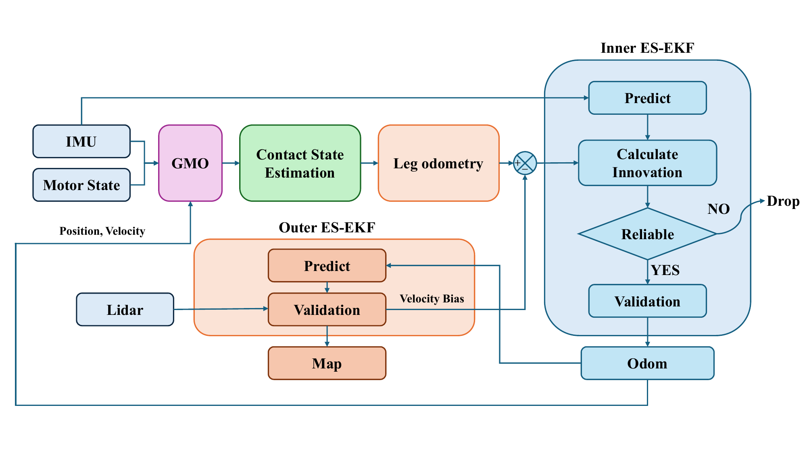

# corgi_odometry

`corgi_odometry` 是 CORGI 輪腳複合機器人的狀態估測 package，包含：

- 以 Generalized Momentum Observer（GMO）進行觸地狀態判斷。
- 使用 IMU propagation 與腿部速度約束的 inner ES-EKF。
- 融合 inner ES-EKF 與 LiDAR odometry 的 outer ES-EKF。
- 模擬用 IMU noise、fake LiDAR 與 ground-truth state 輔助節點。

## 方法與程式來源

觸地狀態與接觸點估測方法來自：

> “Proprioceptive Contact State and Contact Point Estimation for a Leg-Wheel
> Transformable Robot,” in *2026 IEEE International Conference on Robotics and
> Automation (ICRA)*, Vienna, Austria, 2026.

GMO 動力學推導與原始實作來自：

- Repository：<https://github.com/hiho817/ContactLegEstimator>
- SSH：`git@github.com:hiho817/ContactLegEstimator.git`

雙層狀態估測架構圖來自碩士論文《輪腳複合機器人之雙層狀態估測與速度偏差修正》。本圖由該論文的估測器架構圖轉製：



## 估測架構

### Inner ES-EKF

Inner ES-EKF 以 IMU 執行 prediction，並使用腿部運動學速度作為 observation。GMO 根據 IMU、馬達狀態與估測狀態判斷各腿是否接觸地面；只有通過觸地與 innovation reliability 判斷的腿部 observation 才用於更新。

```text
/imu + /motor/state
        │
        ├──► GMO ──► contact state
        │                 │
        └──► IMU predict  ├──► leg observation ──► innovation gate
                          │                           │
                          └───────────────────────────┴──► /ekf
```

### Outer ES-EKF

Outer ES-EKF 使用 inner `/ekf` prediction，並以 `/lidar_odom` 更新 map-to-odom correction 與 velocity bias：

```text
/ekf ──────────► outer predict ─────┐
                                    ├──► /odom_mapping
/lidar_odom ───► outer update ──────┘
                         │
                         └──► /fusion/bv ──► inner ES-EKF velocity correction
```

`/odom_mapping` 是 outer fusion 結果；`/ekf` 是 inner leg ESEKF 結果，兩者不可混為同一個 estimator output。

## 節點功能

| Executable | 用途 | 主要輸入 | 主要輸出 |
|---|---|---|---|
| `corgi_leg_odom` | Inner ES-EKF、GMO、腿部更新 | `/imu`、`/motor/state`、`/trigger`、`/fusion/bv` | `/ekf`、`/gmo/contact_state`、`/ekf/ba`、`/ekf/bw` |
| `corgi_fusion_node` | Outer ES-EKF | `/ekf`、`/lidar_odom`、`/trigger` | `/odom_mapping`、`/fusion/bv`、TF `map → odom` |
| `corgi_contact_leg_est` | 獨立 GMO 接觸估測，僅供模擬與診斷 | `/imu`、`/motor/state`、`/trigger`、`/sim/position`、`/sim/velocity` | `/gmo/contact_state` |
| `velocity_estimator` | 將模擬 TF 轉為 ground-truth state | TF `odom → base_link` | `/sim/position`、`/sim/velocity`、`/sim/body_velocity` |
| `imu_noise_sim` | 注入可重現 IMU noise 與 bias | `/imu` | `/imu_noisy` |
| `fake_lidar_odom` | 產生模擬 LiDAR odometry | `/sim/position` | `/lidar_odom` |
| `odom_tf_relay.py` | 將 FAST-LIO `body` pose 轉成 `base_link` pose | `/Odometry` | `/lidar_odom` |

### 為什麼獨立 contact estimator 僅支援模擬

`corgi_contact_leg_est` 在開始計算前要求 position 與 velocity。模擬環境可由 `velocity_estimator` 從真值 TF 產生這兩項資料；實機沒有獨立 ground-truth position／velocity，因此不能把這個 standalone node 當作實機接觸估測入口。

實機請使用 `corgi_leg_odom`。它以自身 ES-EKF state 提供 GMO 所需的 position／velocity，不依賴模擬 ground truth。

## Launch files

目前 package 只保留五個 launch 入口，沒有 auto-trigger，也沒有 bag replay launch。`/trigger` 必須由 motor driver、實驗控制節點或使用者另外發布。

| Launch | 環境 | 功能 |
|---|---|---|
| `contact_leg_estimator_sim.launch.py` | 模擬 | Ground-truth velocity estimator + standalone GMO contact estimator |
| `leg_odom_real.launch.py` | 實機 | Raw IMU + inner ES-EKF，可選擇錄 bag |
| `leg_odom_sim.launch.py` | 模擬 | Ground truth + deterministic IMU noise + inner ES-EKF |
| `odom_fusion_real.launch.py` | 實機 | Inner ES-EKF + Livox + FAST-LIO + outer fusion，可選擇錄 bag |
| `odom_fusion_sim.launch.py` | 模擬 | Inner ES-EKF + fake LiDAR + outer fusion |

### 1. 模擬獨立觸地判斷

```bash
ros2 launch corgi_odometry contact_leg_estimator_sim.launch.py
```

啟動：

- `velocity_estimator`
- `corgi_contact_leg_est`

資料流：

```text
simulator TF odom→base_link
             │
             ▼
    velocity_estimator
      ├─► /sim/position
      └─► /sim/velocity
             │
/imu + /motor/state + /trigger
             │
             ▼
   corgi_contact_leg_est ──► /gmo/contact_state
```

這個 launch 只適合模擬。若 TF `odom → base_link` 不存在，`velocity_estimator` 無法產生 position／velocity，contact estimator 會持續等待資料。

### 2. 實機 inner ES-EKF

```bash
ros2 launch corgi_odometry leg_odom_real.launch.py
```

啟動：

- `corgi_imu/imu_raw_node`
- `corgi_odometry/corgi_leg_odom`

外部需求：

- motor driver 發布 `/motor/state`
- 外部節點發布 `/trigger`
- IMU driver 正常發布 `/imu_raw`

`/imu` 會 remap 至 `/imu_raw`。

可用參數：

| Argument | Default | 說明 |
|---|---:|---|
| `imu_only` | `false` | 只執行 IMU prediction；停用 GMO、腿部更新、ZUPT 與 fusion feedback |
| `record_bag` | `false` | 啟動 `leg_odom_bag.sh` |
| `record_delay` | `3.0` | 延遲多少秒後開始錄製 |

範例：

```bash
ros2 launch corgi_odometry leg_odom_real.launch.py \
  record_bag:=true record_delay:=3.0
```

IMU-only ablation：

```bash
ros2 launch corgi_odometry leg_odom_real.launch.py imu_only:=true
```

### 3. 模擬 inner ES-EKF

```bash
ros2 launch corgi_odometry leg_odom_sim.launch.py
```

啟動：

- `velocity_estimator`：發布模擬 ground truth，供分析或其他模擬節點使用
- `imu_noise_sim`：將 `/imu` 轉成 `/imu_noisy`
- `corgi_leg_odom`：使用 `/imu_noisy`

可用參數：

| Argument | Default | 說明 |
|---|---:|---|
| `imu_only` | `false` | IMU-only ablation |
| `imu_seed` | `42` | IMU noise／bias random seed；固定值可重現相同 noise realization |

### 4. 實機 inner + outer fusion

```bash
ros2 launch corgi_odometry odom_fusion_real.launch.py
```

啟動：

1. `imu_raw_node`
2. `corgi_leg_odom`
3. Livox MID-360 driver
4. FAST-LIO
5. `odom_tf_relay.py`
6. `corgi_fusion_node`
7. Static TF `base_link → mid360_optical`
8. Optional bag recorder

FAST-LIO 輸出的 `/Odometry` 使用 `camera_init → body`；`odom_tf_relay.py` 使用已知安裝外參將 pose 轉成 `/lidar_odom` 的 `base_link` pose，再交給 outer fusion。

可用參數：

| Argument | Default | 說明 |
|---|---:|---|
| `imu_only` | `false` | Inner estimator 使用 IMU-only mode |
| `record_bag` | `false` | 錄製 odometry／fusion topics，不包含 point cloud |
| `record_delay` | `15.0` | 等待 FAST-LIO 初始化後再開始錄製 |

實機 motor driver 與 `/trigger` publisher 仍需另外啟動。

### 5. 模擬 inner + outer fusion

```bash
ros2 launch corgi_odometry odom_fusion_sim.launch.py
```

資料流：

```text
/imu ─► imu_noise_sim ─► /imu_noisy ─► corgi_leg_odom ─► /ekf
                                                        │
sim TF ─► velocity_estimator ─► /sim/position            ├─► fusion
                                  │                      │
                                  └─► fake_lidar ─► /lidar_odom
```

可用參數：

| Argument | Default | 說明 |
|---|---:|---|
| `imu_only` | `false` | Inner estimator 使用 IMU-only mode |
| `imu_seed` | `42` | IMU noise seed |
| `lidar_seed` | `12345` | Fake LiDAR noise seed |
| `lidar_event_driven` | `false` | `true` 時依 simulation timestamp event 發布；`false` 時使用 wall timer |

## Configuration

```text
config/
├── leg_odom/
│   └── config_online.yaml
└── fusion/
    └── config_fusion.yaml
```

Online nodes 在啟動時固定載入：

- Inner ESEKF／GMO：`config/leg_odom/config_online.yaml`
- Outer fusion：`config/fusion/config_fusion.yaml`

修改 YAML 後需重新啟動 node。非 symlink install 環境應重新執行 build，確保修改後的 YAML 被安裝到 package share directory。

### Inner ES-EKF 與 GMO

編輯：

```text
config/leg_odom/config_online.yaml
```

#### `esekf`

| Parameter | 意義 | 調大時的效果 |
|---|---|---|
| `sigma_a` | Accelerometer noise std，各軸 | 降低對 IMU acceleration propagation 的信任 |
| `sigma_w` | Gyroscope noise std，各軸 | 降低對 IMU angular-rate propagation 的信任 |
| `sigma_ba` | Accelerometer bias random walk | 允許 accelerometer bias 更快變化 |
| `sigma_bw` | Gyroscope bias random walk | 允許 gyroscope bias 更快變化 |
| `sigma_leg_vec` | 腿部速度 observation noise std `[x,y,z]` | 降低該軸腿部速度 observation 的權重 |
| `mahalanobis_threshold` | 腿部 innovation rejection threshold | 放寬 outlier gate；較少 observation 被丟棄 |

`sigma_leg_vec` 是標準差，不是 variance；程式內會平方後建立 observation covariance。`mahalanobis_threshold: 16.27` 對應三維 innovation 的 χ² 99.9% gate。設成非常大的數值可近似停用 rejection，但不建議作為正式設定。

#### `observer`

| Parameter | 意義 | 調整原則 |
|---|---|---|
| `cutoff_freq` | GMO disturbance observer LPF cutoff | 調高反應較快但 noise 增加；調低較平滑但觸地延遲增加 |

#### `contact`

觸地狀態使用 Schmitt trigger：

```text
目前未接觸：|rm| > rm_high 或 |beta| > beta_high  → 接觸
目前已接觸：|rm| < rm_low  且 |beta| < beta_low   → 離地
```

因此必須維持：

```text
rm_threshold_high > rm_threshold_low
beta_threshold_high > beta_threshold_low
```

建議從 bag 中觀察 `/gmo/contact_state` 的 `rm_force` 與 `beta_torque`，分別統計 stance／swing 分布後再調整。不要同時修改 observer cutoff 與 contact thresholds，否則無法判斷改善來自哪一項。

#### `static_init`

| Parameter | 說明 |
|---|---|
| `window_ms` | Trigger 前用於初始 bias／姿態估計的 IMU window |
| `motion_gyro_thresh` | Window 內平均角速度超過此值時提出非靜止警告 |
| `initial_z` | Filter 初始機身高度 |

初始化期間機器人應保持靜止。`initial_z` 應符合實際站立高度，不應只沿用預設 `0.2 m`。

#### `zupt`

| Parameter | 說明 |
|---|---|
| `enabled` | 是否啟用 zero-velocity pseudo measurement |
| `sigma_vec` | 各軸 ZUPT velocity noise std；越小約束越強 |
| `gyro_thresh` | Bias-corrected gyro norm 超過此值時不執行 ZUPT |

#### Logic switches

| Parameter | 說明 |
|---|---|
| `use_dynamic_dt` | 使用 IMU timestamp 計算 propagation dt；online 預設啟用 |
| `use_bv_feedback` | 接受 outer `/fusion/bv` velocity-bias feedback |

Online `corgi_leg_odom` 的 `use_esekf_state` 固定為 `true`；實機不使用外部 `/sim/position` 或 `/sim/velocity`。

### Outer fusion

編輯：

```text
config/fusion/config_fusion.yaml
```

| Parameter | 意義 | 調大時的效果 |
|---|---|---|
| `q_p` | map-to-odom position process noise | 允許 position correction 更快漂移 |
| `q_th` | map-to-odom orientation process noise | 允許 orientation correction 更快漂移 |
| `q_bv` | velocity-bias process noise | 允許 velocity bias 更快改變 |
| `r_p` | LiDAR position measurement variance | 降低對 LiDAR position 的信任 |
| `r_th` | LiDAR orientation measurement variance | 降低對 LiDAR orientation 的信任 |
| `map_frame` | Fusion global frame | 通常維持 `map` |
| `odom_frame` | Inner odometry frame | 通常維持 `odom` |

注意：`q_*` 與 `r_*` 是 variance，不是 standard deviation。實機 FAST-LIO 與模擬 fake LiDAR 的 noise 特性不同，不應直接沿用同一組 `r_p`、`r_th` 而不驗證。

### 建議調參流程

1. 固定資料集、步態、速度與 random seed。
2. 先確認 IMU、motor state、trigger 與 TF 時序正確。
3. 先調 GMO cutoff 與 contact thresholds。
4. 再調 `sigma_leg_vec` 與 Mahalanobis gate。
5. 確認 inner `/ekf` 後，再調 outer `q_*`／`r_*`。
6. 每次只改一組參數並保留 bag、config snapshot 與評估指標。

## Build

```bash
cd ~/corgi_ws/corgi_ros2_ws
source /opt/ros/humble/setup.bash
colcon build --packages-select corgi_odometry --symlink-install
source install/setup.bash
```

檢查 launch arguments：

```bash
ros2 launch corgi_odometry leg_odom_real.launch.py --show-args
ros2 launch corgi_odometry leg_odom_sim.launch.py --show-args
ros2 launch corgi_odometry odom_fusion_real.launch.py --show-args
ros2 launch corgi_odometry odom_fusion_sim.launch.py --show-args
```

## 常見問題

### 一直顯示 `Waiting for trigger`

Package 不會自動發布 trigger。確認實驗控制節點或 motor driver 有發布 `/trigger`。

### Contact estimator 一直等待 position／velocity

確認使用 `contact_leg_estimator_sim.launch.py`，且模擬器提供 TF `odom → base_link`：

```bash
ros2 run tf2_ros tf2_echo odom base_link
ros2 topic info /sim/position --verbose
ros2 topic info /sim/velocity --verbose
```

### Inner ESEKF 沒有輸出

確認：

```bash
ros2 topic hz /imu_raw
ros2 topic hz /motor/state
ros2 topic echo /trigger --once
```

### Fusion 沒有輸出

Fusion 需要 trigger、inner `/ekf` 以及時間接近的 `/lidar_odom`。實機還需等待 FAST-LIO 完成初始化。

### 模擬結果無法重現

固定 `imu_seed` 與 `lidar_seed`，並確保 source bag／模擬初始條件及 config 完全相同。
